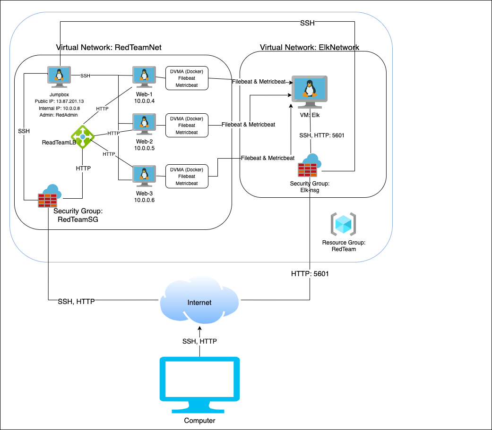
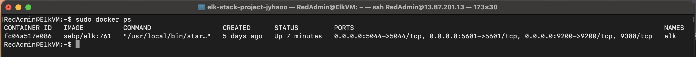

## Automated ELK Stack Deployment

The files in this repository were used to configure the network depicted below.



These files have been tested and used to generate a live ELK deployment on Azure. They can be used to either recreate the entire deployment pictured above. Alternatively, select portions of the playbook file may be used to install only certain pieces of it, such as Filebeat.

### Playbook 1. install-dvma.yml
```
---
  - name: Config Web VM with Docker DVMA
  - hosts: webservers
  - become: true
  - tasks:

    - name: Install Docker.io
      apt: 
        name: docker.io
        update_cache: yes
        state: present

    - name: Install Python3-Pip
      apt: 
        name: python3-pip
        state: present

    - name: Install Docker Python Module
      pip: 
        name: docker
        state: present

    - name: Download the Web DVWA Containers
      docker_container:
        name: dvwa
        image: cyberxsecurity/dvwa
        state: started
        restart_policy: always
        published_ports: 80:80

    - name: Enable the Docker Service
      systemd:
        name: docker
        enabled: yes
```

### Playbook #2: install-elk.yml
```
---
  - name: Config Elk VM with Docker
    hosts: elk
    become: true
    tasks:

    - name: Config target VM to use more memory
      ansible.posix.sysctl:
        name: vm.max_map_count
        value: 262144

    - name: Install Docker.io
      apt: 
        name: docker.io
        update_cache: yes
        force_apt_get: yes
        state: present

    - name: Install Python3-Pip
      apt:
        force_apt_get: yes
        name: python3-pip
        state: present

    - name: Install Docker Module
      pip:
        name: docker
        state: present

    - name: Download and Launch a Docker Elk Container
      docker_container:
        name: elk
        image: sebp/elk:761
        state: started
        restart_policy: always
        published_ports:
          - 5601:5601
          - 9200:9200
          - 5044:5044
```

### Playbook #3: filebeat-playbook.yml
```
---
  - name: Installing and Launching filebeat
    hosts: webservers
    become: yes
    tasks:

    - name: Download Filebeat .deb file
      command: curl -L -O https://artifacts.elastic.co/downloads/beats/filebeat/filebeat-7.6.1-amd64.deb

    - name: Install Filebeat .deb file
      command: dpkg -i filebeat-7.6.1-amd64.deb

    - name: Copy the Filebeat Configuration File
      copy: 
        src: /etc/ansible/files/filebeat-config.yml
        dest: /etc/filebeat/filebeat.yml

    - name: Enable System Module
      command: filebeat modules enable system

    - name: Setup Filebeat
      command: filebeat setup

    - name: Start Filebeat Service
      command: filebeat -e

    - name: Enable Filebeat on boot
      ansible.builtin.systemd:
        name: filebeat
        enabled: yes
```

### Playbook #4: metricbeat-playbook.yml

```
---
  - name: Install and Launch Metricbeat
    hosts: webservers
    become: yes
    tasks:

    - name: Download Metricbeat .deb file
      command: curl -L -O https://artifacts.elastic.co/downloads/beats/metricbeat/metricbeat-7.4.0-amd64.deb

    - name: Install Metricbeat .deb file
      command: dpkg -i metricbeat-7.4.0-amd64.deb

    - name: Copy the Metricbeat configuration file
      copy:
        src: /etc/ansible/files/metricbeat-config.yml
        dest: /etc/metricbeat/metricbeat.yml

    - name: Enable Metricbeat on boot
      ansible.builtin.systemd:
        name: metricbeat
        enabled: yes

    - name: Metricbeat enable docker
      command: metricbeat modules enable docker

    - name: Metric setup
      command: metricbeat setup

    - name: Metric -e
      command: metricbeat -e
```

This document contains the following details:
- Description of the Topologu
- Access Policies
- ELK Configuration
  - Beats in Use
  - Machines Being Monitored
- How to Use the Ansible Build


### Description of the Topology

The main purpose of this network is to expose a load-balanced and monitored instance of DVWA, the D*mn Vulnerable Web Application.

Load balancing ensures that the application will be highly available, in addition to restricting access to the network.
- Load balancers protect the availability aspect of security by sharing user traffic between the servers
- The advantage of having a jumpbox is to ensure that all access to the cloud network comes through a single VM which in return would make monitoring access to the cloud easier

Integrating an ELK server allows users to easily monitor the vulnerable VMs for changes to the configurations and system files.
- Filebeat watches the log files

- Metricbeat records statistics from the monitored VMs

The configuration details of each machine may be found below.

| Name     | Function | IP Address | Operating System |
|----------|----------|------------|------------------|
| Jump Box | Gateway  | 10.0.0.8   | Linux            |
| Web-1    | DVWA     | 10.0.0.4   | Linux            |
| Web-2    | DVWA     | 10.0.0.5   | Linux            |
| Web-3    | DVWA     | 10.0.0.6   | Linux            |
| Elk      | ELK      | 10.1.0.4   | Linux            |

### Access Policies

The machines on the internal network are not exposed to the public Internet. 

Only the Jump Box machine can accept connections from the Internet. Access to this machine is only allowed from the following IP addresses:
- 73.158.156.217

Machines within the network can only be accessed by Jump Box.
- 13.87.201.13

A summary of the access policies in place can be found in the table below.

| Name     | Publicly Accessible | Allowed IP Addresses |
|----------|---------------------|----------------------|
| Jump Box | Yes - SSH           | 73.158.156.216       |
| Web-1    | Yes - HTTP          | 73.158.156.216       |
| Web-2    | Yes - HTTP          | 73.158.156.216       |
| Web-3    | Yes - HTTP          | 73.158.156.216       |
| Elk      | Yes - HTTP          | 73.158.156.216       |

### Elk Configuration

Ansible was used to automate configuration of the ELK machine. No configuration was performed manually, which is advantageous because...
- The main advantages of automating configuration of the ELK machine is to have consistent, reliable and fast deployment. 

The playbook implements the following tasks:
- Install Docker
- Install Python
- Increase virtual memory to 262144
- Download Elk Image
- Launch Docker

The following screenshot displays the result of running `docker ps` after successfully configuring the ELK instance.



### Target Machines & Beats
This ELK server is configured to monitor the following machines:
- Web-1: 10.0.0.4
- Web-2: 10.0.0.5
- Web-3: 10.0.0.6

We have installed the following Beats on these machines:
- Filebeat
- Metricbeat

These Beats allow us to collect the following information from each machine:
- Filebeat collects and logs data collected from the VMs and sends them to the Filebeat agent on Kibana
- Metricbeat collects the metrics of the VMs and sends them to the Metricbeat agent on Kibana

### Using the Playbook
In order to use the playbook, you will need to have an Ansible control node already configured. Assuming you have such a control node provisioned: 

SSH into the control node and follow the steps below:
- Copy the playbook files to the Ansible Docker Container.
- Update the Ansible host file ```/etc/ansible/hosts``` to include the following:
```
[webservers]
10.0.0.4 ansible_python_interpreter=/usr/bin/python3
10.0.0.5 ansible_python_interpreter=/usr/bin/python3
10.0.0.6 ansible_python_interpreter=/usr/bin/python3

[elkservers]
10.1.0.4 ansible_python_interpreter=/usr/bin/python3
```
- Run the playbook, and navigate to Kibana to check that the installation worked as expected.


